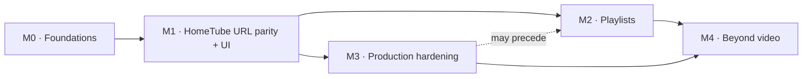

# Roadmap

Progress by **demonstrable capabilities**, not by technical layers. Blocking
foundations first, then steady value, without a rewrite. Every milestone stays
revisable; implementation may surface constraints.

**North star:** Content fully replaces HomeTube (features + the URL UI) while
remaining the general resources → artifacts engine (see
[../product/vision.md](../product/vision.md)).

**States:** considered · ready · in progress · blocked · done.

---

## Foundations already in place (done)

An end-to-end engine: a declarative contract + 2-phase validation; url/file
analysis + TTL cache; deterministic content-addressed planning (sharing,
requiredness); the `video`/`audio`/`metadata`/`thumbnail`/`subtitles`/
`transcript`/`summary` outputs (`single` scope); async jobs, a SQLite queue, an
embedded worker; events + SSE; cancellation; `retry`; `reuse_existing`; schema
migrations; a single-container Docker setup; 542 hermetic backend tests plus 6
CLI, 7 MCP, 24 SDK and 2 layering, with the tool-dependent suite opt-in
(`-m external`) and the end-to-end release checks behind `make validate-release`.
Counts are a snapshot of a real `make validate` run, not a target.

---

## M0 — Verifiable foundations · **done**

- **Goal:** make agentic autonomy reliable and verifiable.
- **Value:** an executable `make validate`, consolidated reference
  documentation, a decided contract policy ("honour it or reject it").
- **Capabilities:** a `ruff format + lint + pytest` harness;
  product/architecture/roadmap/development docs; a written working protocol.
- **Prerequisites:** none.
- **Risks covered:** R1 (no harness), the start of R3 (an honest contract).
- **Exit criteria:** `make validate` green; `vision`/`scope`/`invariants`/
  `roadmap`/`current-milestone`/`validation` in place; the first slice specified.
- **Deferred:** relocating `contract.md`/`domain.md`/`architecture.md` under
  `architecture/` and reformatting the ADRs (cosmetic tidying); a type checker;
  CI.
- **Complexity:** low. **Order:** first — the substrate for everything else.

## M1 — HomeTube "single URL" parity + UI · **ready**

- **Goal:** replace HomeTube day to day on a single video.
- **Value:** the user downloads their videos (including authenticated ones), with
  the quality and options they want, from a UI.
- **Capabilities (vertical slices, in order):**
  1. **Cookies/auth** — download an authenticated video (makes `source.auth`
     real) + selection in the UI. *(the current work package)*
  2. **Quality profiles + deep fallback** (the `engine/profiles.py` know-how).
  3. **SponsorBlock + cut** (trim) as typed options.
  4. **chapters/description/comments, merged/separate, multi-audio, a real
     `delivery`** (folder + naming).
  5. **A web UI dedicated to URLs** (progressive enrichment).
- **Prerequisites:** M0.
- **Risks:** R2 (planner growth) — mitigated as we go by a pilot extraction in
  slice 1; R3 (`auth`/`delivery` become real).
- **Exit criteria:** every slice demonstrable end to end (a real test); no newly
  exposed field that is inert.
- **Deferred:** transcoding; the yt-dlp multi-client fallback if the simple
  selector is enough.
- **Complexity:** medium-high. **Order:** the first product value.

## M2 — Collections / playlists · **in progress**

- **Goal:** process a whole playlist.
- **Capabilities:**
  - `each_item` fan-out — **delivered**. A `collection` resource expands into
    one member step per entry inside a single job (ADR 0019): each member is
    analyzed and planned by the canonical single-resource pipeline, named per
    item and delivered as its own artifact, with member concurrency bounded by
    `CONTENT_COLLECTION_MEMBER_CONCURRENCY` (default 2). ADR 0022 completed it
    for per-member audio.
  - Playlist **synchronization** — **still open**. Keeping a local folder in
    step with a playlist over time: the plan/apply diff, rename detection,
    archiving or deleting removed entries, relocation after a naming or
    location change. Nothing of it exists (`playlist_sync.py` is "Discard (V1)"
    in [../hometube-reuse-audit.md](../hometube-reuse-audit.md), and
    `reuse_existing` is still inert). It is the one standalone-HomeTube feature
    with no equivalent here, and the README says so to anyone arriving from it.
- **Prerequisites:** M1. R4 (a first-class plan in the DB) turned out not to
  block the fan-out.
- **Risks:** the first non-`single` scope — met. "An explosion of child jobs"
  did not happen and cannot: ADR 0019 expands members into steps of one job
  rather than into jobs.
- **Exit criteria:**
  - fan-out — **met**: a playlist URL produces N traceable results in one job.
  - sync — a local folder still matches a playlist that has changed since it was
    first downloaded, without re-downloading what is already there.
- **Complexity:** high (the remainder is the sync half).

## M3 — Production hardening · **considered** (may precede M2 if usage demands it)

- **Goal:** operable without supervision.
- **Capabilities:** observability (structured logs, per-job correlation, exposing
  step logs); effective retention; intra-job resumption; finishing the
  contract's honesty; filtering reuse (INV-101). Optional: Jellyfin,
  notifications.
- **Prerequisites:** M1.
- **Risks covered:** R4, R5, R7, R8, the rest of R3.
- **Exit criteria:** an incident can be diagnosed from the events and the exposed
  logs; retention is applied.
- **Complexity:** medium.

## M4 — Beyond video · **considered**

- **Goal:** harvest the general engine.
- **Capabilities:** `upload`/`text`/PDF sources; `ocr`/`keyframes`/`embeddings`
  outputs; a more versatile UI; a CLI/SDK.
- **Prerequisites:** a stabilized contract (M1–M3).
- **Complexity:** high.

---

## Dependencies between milestones

The detail of the active milestone is in [current-milestone.md](current-milestone.md).
Open tensions and debt are tracked in the maintainer's working notes, which are
not versioned.
